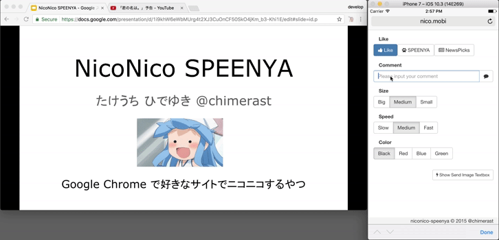

NicoNico SPEENYA
====

[](LICENSE)

ブラウザに、ニコニコ動画のように右から左に流れるコメントを表示する、Chrome機能拡張とそのサーバプログラムです。

スタンプボタンを押すと画像が浮き上がったりします。

主にブラウザを使ったプレゼンテーションで使用すると(いわゆるニコニコメソッド)、視聴者とコミュニケーションがとれて良い感じです。

Google Slidesやネット上のPDFをChromeで開いた上にも表示出来ます(ただし、HTTPSで公開されたサーバが必要)。

注意: 細かいこと考えてないので、このソースコードのまま一般公開サーバとか作ると大変なことになる気がします。



## 開発動機

社内の会議の所帯が大きくなり一人一人が発言しづらくなってきたため、コミュニケーションを促進するために作りました。

## 参考

[ニコニコメソッドプレゼンを全社会議に取り入れてみたら会議が面白くなった](http://tech.uzabase.com/entry/2015/06/01/143202)

## [WIP]動かし方

### Docker

```bash
export DOMAIN_NAME=[domain-name] # 適宜指定

docker run --rm \
  -v $(pwd)/data/:/app/data/ \
  -p 8080:8080 -e "SERVER_URL=https://${DOMAIN_NAME}" \
  chimerast/niconico-speenya:develop
```

### Cloud Run

参考資料: https://cloud.google.com/run/docs/mapping-custom-domains

```bash
export PROJECT_ID=[project-id] # 適宜指定
export DOMAIN_NAME=[domain-name] # 適宜指定

docker pull chimerast/niconico-speenya:develop
docker tag chimerast/niconico-speenya:develop gcr.io/${PROJECT_ID}/niconico-speenya
docker push gcr.io/${PROJECT_ID}/niconico-speenya
gcloud run deploy niconico-speenya \
  --project=${PROJECT_ID} \
  --platform=managed \
  --region=asia-northeast1 \
  --allow-unauthenticated \
  --image=gcr.io/${PROJECT_ID}/niconico-speenya \
  --cpu=1 \
  --memory=256Mi \
  --max-instances=1 \
  --set-env-vars="SERVER_URL=https://${DOMAIN_NAME}"
gcloud beta run domain-mappings create \
  --project=${PROJECT_ID} \
  --platform=managed \
  --region=asia-northeast1 \
  --service=niconico-speenya \
  --domain=${DOMAIN_NAME}
```

### 機能拡張

`https://[DOMAIN_NAME]/extensions.zip` にアクセスすると、zipファイルがダウンロードできるので、それを `chrome://extensions` で表示される、機能拡張一覧ページにドラッグ&ドロップしてください。

## ライセンス

[Apache License 2.0](LICENSE)
