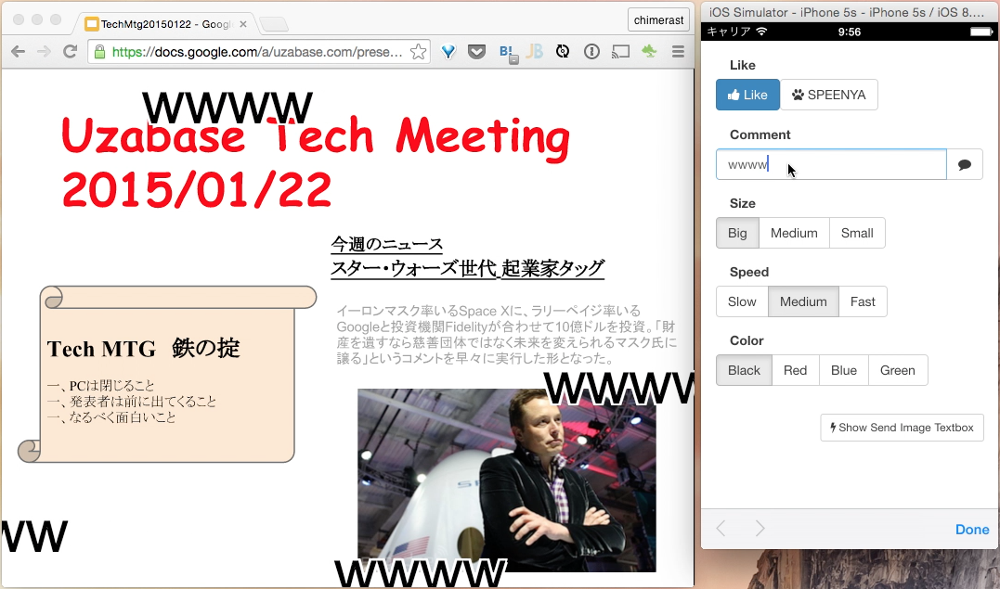

NicoNico SPEENYA
====

[](LICENSE)


ブラウザに、ニコニコ動画のように右から左に流れるコメントを表示する、Chrome機能拡張とサーバプログラムです。Likeボタンを押すといいね画像が浮き上がったりします。

主にブラウザを使ったプレゼンテーションで使用すると(いわゆるニコニコメソッド)、視聴者とコミュニケーションがとれて良い感じです。

Google Slidesやネット上のPDFをChromeで開いた上にも表示出来ます(**ただし、SSLで公開されたWebサーバが必要**)。

**注意**: 細かいこと考えてないので、このソースコードのまま一般公開サーバとか作ると大変なことになる気がします。

[スクリーンキャプチャ動画 (YouTube)](http://youtu.be/M0kr4aONMHQ)



### 開発動機

社内の会議の所帯が大きくなり一人一人が発言しづらくなってきたので、コミュニケーションを促進するために作りました。

### 中身

* **server.js** - node.jsで書かれたサーバプログラム
* **extension** - クライアントとしてのChrome機能拡張

### 動かし方

```bash
$ npm start
```

を実行してサーバプログラムを立ち上げ、extensionフォルダの中身をChrome機能拡張として登録してください。

[http://localhost:2525/](http://localhost:2525/)にアクセスすると入力画面が表示されます。

外部サーバで動かす場合は、`extension/scripts/niconico-script.js`の一番上の方にある接続先URLを変更してビルドしてください。

Google Apps for Workとかで、社内向け限定公開でChromeウェブストアに登録する場合は、`make-package.sh`を実行してできたzipファイル(dist/extension.zip)を登録すれば大丈夫なはずです。

### ライセンス
[Apache License 2.0](LICENSE)
